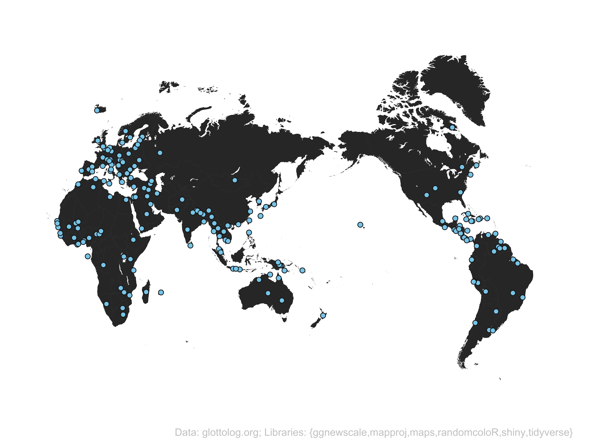

# glottoshinyR and custom mapping in R
Pacific-centered Glottolog Language Maps
<br>

## Shiny app: _GlottoshinyR_
This repository stores the Shiny app [https://linguistr.shinyapps.io/glottoshinyR/](https://linguistr.shinyapps.io/glottoshinyR/), such that users who may find the online server host unavailable can still access the app by running it locally in RStudio, accessed from GitHub using the `runGithub()` function from the `{shiny}` package:
```
shiny::runGitHub( "glottoshinyr", "borstell", ref="main")
```

## R code for custom mapping
The repo also contains an R script for users more familiar with R, which can be used to plot similar maps with more customization. For more advanced Glottolog mapping with R, see e.g. the [glottospace](https://github.com/SietzeN/glottospace)</a> package.

## _– Note:_
Glottolog and the R libraries used to create this mapping tool are automatically included in a text caption at the bottom of the output plot, but make sure to cite these source accordingly should you use the map for a paper or presentation or similar: [Glottolog](https://glottolog.org/meta/cite), [ggnewscale](https://cran.r-project.org/web/packages/ggnewscale/index.html), [mapproj](https://cran.r-project.org/web/packages/mapproj/index.html), [maps](https://cran.r-project.org/web/packages/maps/index.html), [randomcoloR](https://cran.r-project.org/web/packages/randomcoloR/index.html), [tidyverse](https://www.tidyverse.org) and – if you are using the app – [shiny](https://cran.r-project.org/web/packages/shiny/index.html).

_Happy mapping!_
